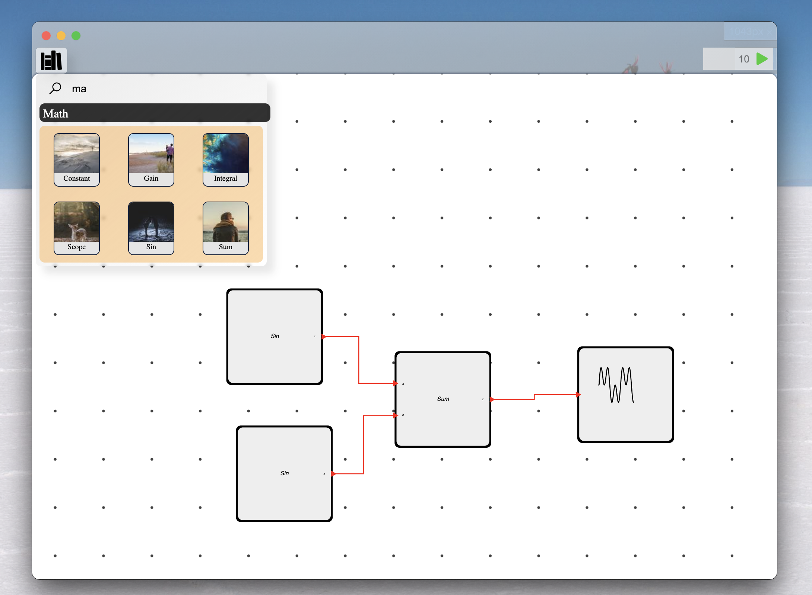

# CompX

---

> A visual, simple and fast Typescript block language for computation and simulation.

**Badges**

- In Development
- **Issues:**
  - Needs compiler and front end built

---

## Background

&nbsp;&nbsp;&nbsp;&nbsp;The project utilizes a Typescript backend to handle graph creation and execution which is marked by the Graph Library.  The Graph Library holds block components which can be altered to have an arbitrary number of ports of various types which are connected to other blocks with edges.  The graph data structure includes useful utilities to analyse and run the graph in the correct sorting order.

&nbsp;&nbsp;&nbsp;&nbsp;The Graph Builder then automates the creation of the blocks from JSON files located on disk to represent the addition of blocks to the canvas.  The Graph Builder also utilizes the javascript compiler to dynamically build and run the newly created graph.

&nbsp;&nbsp;&nbsp;&nbsp;The CompX project aims to package for cross platform use with the help of [Electron](https://www.electronjs.org).  Utilizing the power of electron, the frontend can be developed using familiar Javascript and CSS while leveraging the agility of the React framework.

---

## Install

A beginning guide to installing and developing the CompX software.

Reinstall all npm packages

```bash
$ npm install
```

Start the Electron application

```bash
$ npm run start
```

---

## UI Current

---

## Example Graph

